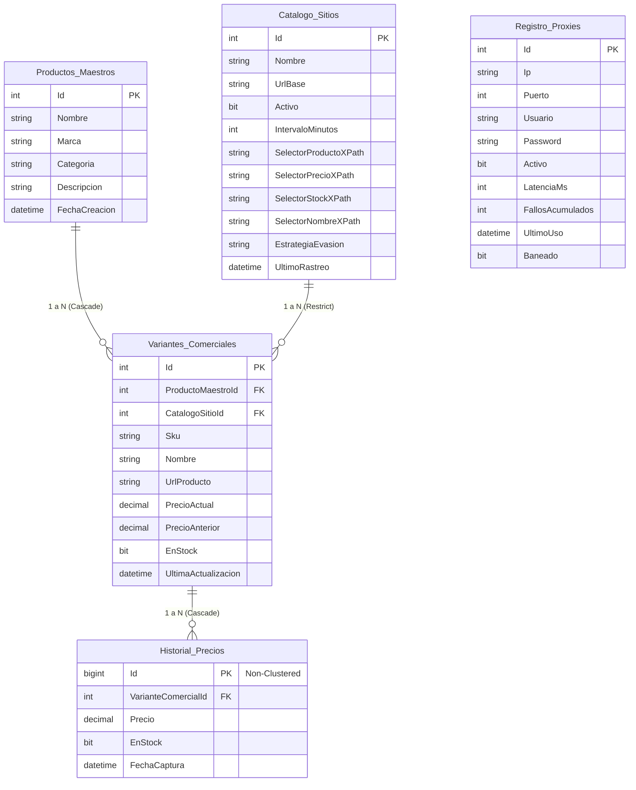

# Esquema de la Base de Datos - Teocuitla 📊

Este archivo describe la estructura física, entidades, columnas, relaciones y optimizaciones de índices implementadas en la base de datos de **Teocuitla**.

Adicionalmente, se ha generado el archivo binario independiente **[DBSchema.db](file:///d:/Github/Teocuitla/DBSchema.db)** en la raíz del repositorio. Este archivo es una base de datos física **SQLite** completamente funcional que contiene exactamente las tablas, llaves primarias, llaves foráneas, relaciones e índices que se detallan a continuación, permitiendo su importación y visualización en cualquier gestor de bases de datos (como DBeaver o DB Browser for SQLite).

---

## 🗺️ Diagrama de Relaciones (Mermaid)

---

## 📑 Catálogo de Entidades y Columnas

### 1. `Productos_Maestros`
Representa el producto global o principal que se desea monitorear en el sistema (por ejemplo: *"Samsung Galaxy S24 Ultra"*).
* **`Id`** `(int, PK, Identity)`: Identificador único del producto maestro.
* **`Nombre`** `(nvarchar(200), Not Null)`: Nombre comercial genérico del producto.
* **`Marca`** `(nvarchar(100), Not Null)`: Marca del fabricante del producto.
* **`Categoria`** `(nvarchar(100), Not Null)`: Categoría de clasificación (ej. *"Smartphones"*).
* **`Descripcion`** `(nvarchar(1000), Not Null)`: Ficha descriptiva breve.
* **`FechaCreacion`** `(datetime2, Not Null)`: Fecha de registro en el sistema.

### 2. `Catalogo_Sitios`
Almacena los portales de e-commerce donde se realizarán las tareas de scraping, junto con la configuración técnica requerida para extraer los datos de cada uno.
* **`Id`** `(int, PK, Identity)`: Identificador único del portal.
* **`Nombre`** `(nvarchar(100), Not Null)`: Nombre del sitio web (ej. *"Amazon"*, *"MercadoLibre"*).
* **`UrlBase`** `(nvarchar(500), Not Null)`: URL raíz del sitio.
* **`Activo`** `(bit, Not Null)`: Bandera para habilitar/deshabilitar el rastreo de este sitio.
* **`IntervaloMinutos`** `(int, Not Null)`: Frecuencia de rastreo en minutos (por defecto `360` - 6 horas).
* **`SelectorProductoXPath`** `(nvarchar(500), Empty)`: Selector del contenedor del producto.
* **`SelectorPrecioXPath`** `(nvarchar(500), Not Null)`: Selector XPath o CSS para extraer el precio del producto.
* **`SelectorStockXPath`** `(nvarchar(500), Empty)`: Selector para evaluar la disponibilidad de stock.
* **`SelectorNombreXPath`** `(nvarchar(500), Empty)`: Selector para capturar el nombre específico en tienda.
* **`EstrategiaEvasion`** `(nvarchar(50), Not Null)`: Nivel de seguridad anti-bot requerido (`"Standard"`, `"Cloudflare"`, `"Heavy-JS"`, etc.).
* **`UltimoRastreo`** `(datetime2, Nullable)`: Timestamp de la última vez que el Worker procesó este sitio.

### 3. `Variantes_Comerciales`
Constituye la presencia real de un producto maestro en una tienda específica. Vincula un `ProductoMaestro` con un `CatalogoSitio` y guarda el estado de precio y stock actual.
* **`Id`** `(int, PK, Identity)`: Identificador único de la variante.
* **`ProductoMaestroId`** `(int, FK, Not Null)`: Relación hacia `Productos_Maestros`.
* **`CatalogoSitioId`** `(int, FK, Not Null)`: Relación hacia `Catalogo_Sitios`.
* **`Sku`** `(nvarchar(100), Not Null)`: Código SKU identificador del producto específico en esa tienda.
* **`Nombre`** `(nvarchar(300), Not Null)`: Nombre del producto tal como se muestra en ese portal.
* **`UrlProducto`** `(nvarchar(1000), Not Null)`: Enlace directo a la página de compra del producto.
* **`PrecioActual`** `(decimal(18,2), Nullable)`: Último precio extraído exitosamente.
* **`PrecioAnterior`** `(decimal(18,2), Nullable)`: Precio registrado en el rastreo previo (para calcular fluctuaciones).
* **`EnStock`** `(bit, Not Null)`: Estado de disponibilidad física del producto.
* **`UltimaActualizacion`** `(datetime2, Nullable)`: Timestamp del último rastreo exitoso de esta variante.

### 4. `Historial_Precios`
Tabla histórica de alta frecuencia de escritura encargada de registrar los cambios de precio y stock de cada variante a lo largo del tiempo, permitiendo generar gráficos e informes analíticos.
* **`Id`** `(bigint, PK, Identity)`: Identificador único del registro histórico. Se configura físicamente como **llave primaria no agrupada (Non-Clustered)**.
* **`VarianteComercialId`** `(int, FK, Not Null)`: Relación hacia la entidad `Variantes_Comerciales`.
* **`Precio`** `(decimal(18,2), Not Null)`: Precio registrado en el instante del rastreo.
* **`EnStock`** `(bit, Not Null)`: Disponibilidad de stock en el instante del rastreo.
* **`FechaCaptura`** `(datetime2, Not Null)`: Fecha y hora exacta en la que se realizó la extracción de datos.

### 5. `Registro_Proxies`
Tabla de soporte de red para la rotación de IPs del scraper.
* **`Id`** `(int, PK, Identity)`: Identificador del proxy.
* **`Ip`** `(nvarchar(100), Not Null)`: Dirección IP del proxy.
* **`Puerto`** `(int, Not Null)`: Puerto de conexión.
* **`Usuario`** `(nvarchar(100), Empty)`: Credencial de usuario para proxies autenticados.
* **`Password`** `(nvarchar(100), Empty)`: Contraseña para proxies autenticados.
* **`Activo`** `(bit, Not Null)`: Estado administrativo del proxy.
* **`LatenciaMs`** `(int, Not Null)`: Última latencia medida en milisegundos.
* **`FallosAcumulados`** `(int, Not Null)`: Contador de errores consecutivos (se banea al llegar a 5).
* **`UltimoUso`** `(datetime2, Nullable)`: Timestamp del último uso en rotación.
* **`Baneado`** `(bit, Not Null)`: Indica si el proxy fue bloqueado automáticamente por fallos recurrentes o baneo de IP.

---

## ⚡ Índices y Optimizaciones Físicas

Para garantizar tiempos de respuesta inmediatos en consultas complejas (como generación de gráficos históricos y visualización de dashboards), se han aplicado las siguientes optimizaciones a nivel de base de datos:

1. **Índice Agrupado Compuesto (Clustered Index)**:
   * **Nombre**: `IX_HistorialPrecios_VarianteId_FechaCaptura_Clustered`
   * **Tabla**: `Historial_Precios`
   * **Columnas**: `(VarianteComercialId, FechaCaptura)`
   * **Razón**: Por defecto, SQL Server asigna el índice agrupado a la llave primaria `Id`. Debido a que las consultas analíticas del historial de precios siempre filtran por una variante comercial específica y ordenan por fecha de captura, desmarcar la PK `Id` y crear este índice agrupado compuesto almacena físicamente las filas ordenadas por variante y fecha en el disco, eliminando operaciones costosas de ordenamiento y reduciendo la latencia de consulta a microsegundos.
   
2. **Índice de Estadísticas Rápidas**:
   * **Nombre**: `IX_HistorialPrecios_FechaCaptura`
   * **Tabla**: `Historial_Precios`
   * **Columna**: `FechaCaptura`
   * **Razón**: Optimiza las consultas globales del dashboard que analizan fluctuaciones dentro de rangos temporales específicos (por ejemplo, "precios modificados en las últimas 24 horas").

3. **Índice de Búsqueda de SKUs**:
   * **Nombre**: `IX_VariantesComerciales_Sku`
   * **Tabla**: `Variantes_Comerciales`
   * **Columna**: `Sku`
   * **Razón**: Permite al motor de scraping y a la API de ingesta validar e identificar instantáneamente si un SKU de variante ya existe en la base de datos antes de registrar nuevos productos.
